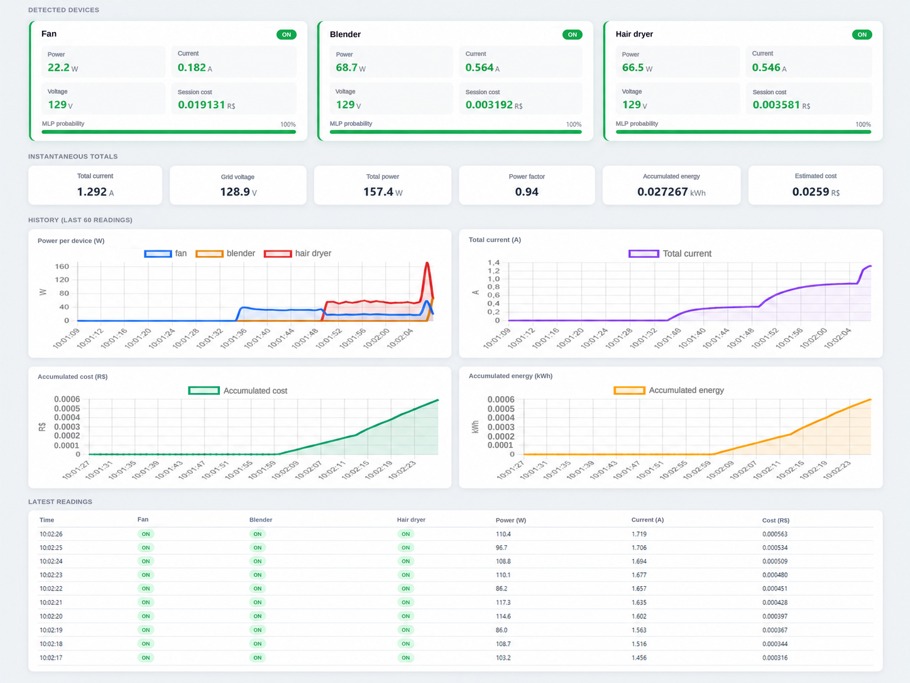

# Real-Time NILM with TinyML on ESP32

A low-cost **Non-Intrusive Load Monitoring (NILM)** system for real-time residential energy monitoring using embedded machine learning on an **ESP32**.

The prototype acquires aggregated electrical signals, extracts statistical features, performs local appliance classification, measures electrical quantities, and sends the results to a web dashboard for remote monitoring.

## Overview

The system was developed as part of a Master's dissertation in Electrical Engineering and integrates:

* Current and voltage acquisition
* Statistical feature extraction
* Multilabel appliance identification
* Embedded MLP inference on ESP32
* Real-time electrical measurements
* Energy and cost estimation
* REST communication with a Node.js backend
* MongoDB data storage
* Web-based monitoring dashboard

The experimental setup considers three residential appliances:

* Fan
* Blender
* Hair dryer

All **8 possible operating states** are represented in the NILM dataset.

## System Architecture

```text
                        ┌─────────────────────┐
                        │  Residential Loads  │
                        └──────────┬──────────┘
                                   │
                                   ▼
                    ┌──────────────────────────┐
                    │ Aggregated Measurement   │
                    │ SCT-013 + ZMPT101B       │
                    └─────────────┬────────────┘
                                  │
                                  ▼
                    ┌──────────────────────────┐
                    │          ESP32           │
                    │                          │
                    │ ADC Acquisition          │
                    │ Feature Extraction       │
                    │ Standardization          │
                    │ Embedded MLP Inference   │
                    │ Temporal Filtering       │
                    │ Energy / Cost Estimation │
                    └─────────────┬────────────┘
                                  │ HTTP / JSON
                                  ▼
                    ┌──────────────────────────┐
                    │      Node.js API         │
                    └─────────────┬────────────┘
                                  │
                                  ▼
                    ┌──────────────────────────┐
                    │         MongoDB          │
                    └─────────────┬────────────┘
                                  │
                                  ▼
                    ┌──────────────────────────┐
                    │      Web Dashboard       │
                    └──────────────────────────┘
```

## Repository Structure

```text
nilm-tinyml-esp32/
│
├── dashboard/
│   ├── server.js
│   └── public/
│       └── dashboard.html
│
├── dataset/
│   ├── Dataset\\\_NILM.csv
│   └── Program.cs
│
├── firmware/
│   ├── NILM\\\_ESP32.ino
│   └── nilm\\\_model.h
│
├── models/
│   └── train\\\_dataset\\\_nilm.py
│
├── docs/
│   ├── dashboard.png
│   ├── hardware\\\_setup.png
│   ├── current\\\_sensor\\\_circuit.png
│   └── experimental\\\_result\\\_figures/
│
├── README.md
├── .gitignore
└── .gitattributes
```

## Hardware

The prototype uses:

* ESP32 development board
* SCT-013 current sensor
* ZMPT101B voltage sensor
* Signal-conditioning components
* Prototype board and connection components

The following diagram presents the experimental hardware configuration used in the prototype.

<p align="center">
  
</p>

<p align="center">
  <em>Experimental hardware configuration of the NILM prototype.</em>
</p>

In the current firmware:

* `GPIO 34` is used for current acquisition
* `GPIO 35` is used for voltage acquisition
* ADC resolution is configured to 12 bits

Sensor calibration parameters are defined directly in the firmware and should be recalibrated when reproducing the prototype with different sensors or conditioning circuits.

### Current Sensor Conditioning Circuit

The SCT-013 current-sensor signal is conditioned before being connected to the ESP32 ADC. The conditioning stage includes the burden resistor, DC bias network, and filtering capacitors used by the prototype.

<p align="center">
  
</p>

<p align="center">
  <em>Signal-conditioning circuit for the SCT-013 current sensor.</em>
</p>

## NILM Dataset

The dataset contains aggregated ADC measurements and three binary appliance labels:

```text
adc,fan,blender,hair dryer
```

The three labels represent the ON/OFF state of:

1. Fan
2. Blender
3. Hair dryer

With three binary loads, the experimental dataset includes all **8 possible operating combinations**.

The C# data collection utility is available in:

```text
dataset/Program.cs
```

The generated dataset is stored in:

```text
dataset/Dataset\\\_NILM.csv
```

## Signal Processing

The NILM pipeline uses windows of:

* **256 samples**
* **128-sample step**
* **50% overlap**
* Sampling rate of approximately **8.2 kHz**

Nine statistical time-domain features are extracted from each window:

1. Mean
2. Standard deviation
3. AC RMS
4. Minimum
5. Maximum
6. Peak-to-peak amplitude
7. Energy
8. 5th percentile
9. 95th percentile

The features are standardized using `StandardScaler` before classification.

## Machine Learning

The experimental pipeline evaluates three machine-learning algorithms:

* Multilayer Perceptron (MLP)
* Random Forest (RF)
* Decision Tree (DT)

The MLP was selected for embedded deployment on the ESP32.

The embedded model included in this repository uses the following architecture:

```text
9 inputs → 32 neurons → 16 neurons → 8 neurons → 3 outputs
```

The three outputs correspond to:

```text
\\\[fan, blender, hair dryer]
```

### Embedded Model Results

The embedded model header reports the following hold-out results:

|Metric|Result|
|-|-:|
|Accuracy|99.84%|
|Macro F1-score|0.9995|
|Hamming loss|0.0005|
|Hold-out windows|1,248|
|Classification errors|2|

## Embedded Inference

The trained model parameters and normalization coefficients are stored in:

```text
firmware/nilm\\\_model.h
```

Inference is executed locally on the ESP32 using C/C++ operations, without requiring an external machine-learning runtime on the microcontroller.

The firmware also applies temporal smoothing, hysteresis, and debounce logic to stabilize appliance state transitions.

## Electrical Measurements

In addition to NILM classification, the ESP32 estimates:

* RMS voltage
* RMS current
* Active power
* Apparent power
* Power factor
* Accumulated energy
* Estimated energy cost

Electrical measurements and NILM results are transmitted to the backend as JSON data.

## Web Dashboard

The monitoring interface displays:

* Detected appliance states
* MLP probabilities
* Per-device power and current
* Total voltage and current
* Total active power
* Power factor
* Accumulated energy
* Estimated cost
* Historical charts
* Recent measurements

The dashboard uses **Chart.js** for data visualization.

<p align="center">
  
</p>

<p align="center">
  <em>Web dashboard for real-time NILM monitoring and electrical measurements.</em>
</p>

## Backend

The backend is implemented with:

* Node.js
* Express
* MongoDB
* CORS

The API provides the following main endpoints:

```text
POST /measure
GET  /measurements
GET  /latest
GET  /dashboard
```

By default, MongoDB is expected at:

```text
mongodb://localhost:27017
```

Database:

```text
nilm\\\_db
```

Collection:

```text
measurements
```

## Requirements

### Machine Learning

Recommended environment:

```text
Python 3.10
NumPy 1.24
pandas 2.0
scikit-learn 1.3
```

Install the main Python dependencies with:

```bash
pip install numpy pandas scikit-learn
```

### Backend

Install Node.js and MongoDB, then install the required packages:

```bash
npm install express mongodb cors
```

### ESP32

Use an ESP32-compatible Arduino environment.

The firmware uses:

```text
WiFi.h
HTTPClient.h
time.h
```

The timer implementation is intended for ESP32 Arduino Core 3.x.

## Running the Project

### 1\. Configure the backend

Make sure MongoDB is running locally.

From the `dashboard` directory:

```bash
node server.js
```

The dashboard will be available at:

```text
http://localhost:3000/dashboard
```

### 2\. Configure the ESP32

Before compiling the firmware, configure:

```cpp
#define WIFI\\\_SSID     "YOUR\\\_WIFI\\\_SSID"
#define WIFI\\\_PASSWORD "YOUR\\\_WIFI\\\_PASSWORD"
#define SERVER\\\_URL    "http://YOUR\\\_SERVER\\\_IP:3000/measure"
```

Keep `nilm\\\_model.h` in the same firmware project directory as `NILM\\\_ESP32.ino`.

### 3\. Upload the firmware

Compile and upload:

```text
firmware/NILM\\\_ESP32.ino
```

to the ESP32.

### 4\. Start monitoring

With the ESP32 and backend connected to the same network, the device sends NILM classifications and electrical measurements to the server periodically.

Open the dashboard in a browser to monitor the system in real time.

## Model Training

The Python training script is available at:

```text
models/train\\\_dataset\\\_nilm.py
```

Before running the script, make sure `CSV\\\_PATH` points to the correct location of:

```text
dataset/Dataset\\\_NILM.csv
```

The training script performs:

* Dataset loading
* Window segmentation
* Statistical feature extraction
* Temporal train/test split
* Feature standardization
* MLP training
* Random Forest training
* Decision Tree training
* Model evaluation

> \\\*\\\*Important:\\\*\\\* `firmware/nilm\\\_model.h` is the embedded model used by the current prototype. Do not overwrite it with a newly generated model header unless the generated interface and numerical results have been validated against the firmware.

## Security

Wi-Fi credentials, passwords, API tokens, and private server addresses should **never be committed to the repository**.

The public firmware should use placeholders such as:

```cpp
#define WIFI\\\_SSID     "YOUR\\\_WIFI\\\_SSID"
#define WIFI\\\_PASSWORD "YOUR\\\_WIFI\\\_PASSWORD"
#define SERVER\\\_URL    "http://YOUR\\\_SERVER\\\_IP:3000/measure"
```

## Academic Context

This repository contains the source code and experimental materials developed for a Master's dissertation in Electrical Engineering at the **Federal University of Itajubá (UNIFEI), Brazil**.

**Author:** Herman Cristiano Jaime

## Citation

If you use this repository in academic work, please cite the associated dissertation.

The complete bibliographic reference can be added here after the dissertation is officially published.

## License

\## License


This project is licensed under the MIT License.


See the \[LICENSE](LICENSE) file for details.

